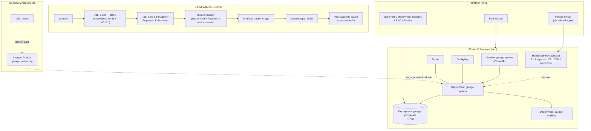

# Garage System — Sistema de Gestão de Oficina

Sistema back-end para gestão de uma oficina mecânica, desenvolvido para o **Tech Challenge** da Pós-Graduação POSTECH em Software Architecture.

- **Fase 1**: MVP funcional (CRUDs, fluxo de OS, autenticação JWT, aprovação de orçamento por e-mail).
- **Fase 2**: evolução para produção — Clean Architecture/Hexagonal, containerização, orquestração em Kubernetes, Infraestrutura como Código com Terraform e pipeline de CI/CD.

---

## Índice

- [Sobre o projeto](#sobre-o-projeto)
- [Tecnologias](#tecnologias)
- [Arquitetura da aplicação](#arquitetura-da-aplicação)
- [Arquitetura de infraestrutura (Fase 2)](#arquitetura-de-infraestrutura-fase-2)
- [Funcionalidades](#funcionalidades)
- [Como executar — Docker Compose (desenvolvimento local)](#como-executar--docker-compose-desenvolvimento-local)
- [Como executar — Kubernetes local (kind)](#como-executar--kubernetes-local-kind)
- [Provisionamento com Terraform](#provisionamento-com-terraform)
- [Pipeline de CI/CD](#pipeline-de-cicd)
- [Variáveis de ambiente](#variáveis-de-ambiente)
- [Documentação da API](#documentação-da-api)
- [Testes](#testes)
- [Estrutura do projeto](#estrutura-do-projeto)
- [Segurança](#segurança)

---

## Sobre o projeto

O **Garage System** é um sistema integrado que permite à oficina mecânica gerenciar todo o ciclo de atendimento de veículos, desde a abertura da Ordem de Serviço até a entrega ao cliente.

O cliente pode acompanhar em tempo real o status do serviço e autorizar reparos via e-mail, enquanto a equipe interna gerencia ordens de serviço, peças, insumos e serviços de forma eficiente e segura.

Na Fase 2, o objetivo passou a ser **evoluir essa aplicação para suportar crescimento**: múltiplas unidades, picos de demanda e alta disponibilidade — sem abrir mão de qualidade de código e testabilidade.

---

## Tecnologias

| Tecnologia | Versão | Finalidade |
|---|---|---|
| Java | 17 | Linguagem principal |
| Spring Boot | 4.0.6 | Framework back-end |
| Spring Security | incluso no Spring Boot | Autenticação e autorização |
| PostgreSQL | 16 | Banco de dados principal |
| H2 | - | Banco em memória para testes |
| Flyway | - | Migrations do banco de dados |
| JWT (jjwt) | 0.12.5 | Autenticação stateless |
| springdoc-openapi | 2.x | Documentação Swagger |
| Lombok | - | Redução de boilerplate |
| JaCoCo | 0.8.11 | Cobertura de testes |
| Spring Actuator | - | Health checks para probes do Kubernetes |
| Docker | - | Containerização |
| MailHog | - | Servidor SMTP para desenvolvimento |
| Kubernetes (kind) | v1.31 | Orquestração de containers |
| Terraform | >= 1.9 | Infraestrutura como Código |
| GitHub Actions | - | CI/CD |

### Por que PostgreSQL?

- **ACID completo** — garante consistência nas transações críticas (ex: decrementar estoque e criar OS atomicamente)
- **Suporte nativo a JPA/Hibernate** — sem configurações extras
- **Gratuito e open-source** — sem custo de licença
- **Imagem Docker leve** — `postgres:16-alpine`
- **Amplamente usado em produção** — maturidade e documentação abundante

---

## Arquitetura da aplicação

O projeto segue **Domain-Driven Design (DDD)** combinado com **Arquitetura Hexagonal (Ports & Adapters)**: o domínio é um núcleo de Java puro, isolado de qualquer framework, e a persistência (JPA) é um detalhe de infraestrutura plugado por fora através de mappers.

```
src/main/java/com/pedrocmoreira/garagesystem/
│
├── domain/                    ← Regras de negócio puras. Zero dependências externas (nem JPA, nem Spring).
│   ├── model/                 ← Entidades e Agregados de domínio (POJOs), Enums de estado
│   ├── repository/            ← Interfaces (portas de saída)
│   ├── service/                ← Domain Services e Validadores
│   └── exception/              ← Exceções do domínio
│
├── application/                ← Casos de uso. Orquestra domain + repositories. Não conhece JPA.
│   └── usecase/
│
├── infrastructure/              ← Adapters: detalhes técnicos plugados no domínio
│   ├── persistence/
│   │   ├── entity/              ← Entidades JPA (mapeamento de tabelas, anotações @Entity)
│   │   ├── mapper/              ← Conversão domínio ↔ entidade JPA
│   │   └── *RepositoryImplement ← Implementação das portas de saída (Spring Data JPA)
│   ├── security/                ← JWT, Spring Security
│   ├── mail/                    ← Envio de e-mail (SMTP)
│   └── config/                  ← Configurações Spring, seed de dados
│
└── presentation/                 ← Controllers REST, DTOs, tratamento de erros
    └── controller/
```

**Regra de dependência**: `domain` não importa nada de `infrastructure`. É `infrastructure` que depende de `domain` (nunca o contrário) — é isso que permite trocar o banco de dados, o provedor de e-mail ou o framework web sem tocar em uma linha de regra de negócio.

---

## Arquitetura de infraestrutura (Fase 2)



### Fluxo de deploy resumido

1. **Build**: `docker build` gera a imagem da aplicação a partir do `Dockerfile` multi-stage (build com Maven, runtime com JRE).
2. **Provisionamento**: Terraform (`/infra`) cria o cluster Kubernetes local (`kind`), o banco PostgreSQL (como Deployment + PVC + Service dentro do próprio cluster) e o `metrics-server` (necessário para o HPA calcular utilização de CPU/memória).
3. **Carregamento da imagem**: como não há um registry externo nesse cenário local, a imagem é carregada diretamente nos nós do cluster com `kind load docker-image`.
4. **Deploy da aplicação**: `kubectl apply -f k8s/` aplica Deployment, Service, ConfigMap, Secret e HPA.
5. **Escalabilidade automática**: o HPA monitora CPU e memória dos pods e escala entre 2 e 6 réplicas conforme a demanda.

---

## Funcionalidades

### Fluxo da Ordem de Serviço

```
RECEBIDA → EM_DIAGNOSTICO → AGUARDANDO_APROVACAO → EM_EXECUCAO → FINALIZADA → ENTREGUE
                                      ↓
                                  CANCELADA
```

Ao atingir `AGUARDANDO_APROVACAO`, o sistema envia automaticamente um e-mail ao cliente com links para **aprovar** ou **recusar** o orçamento.

### APIs disponíveis

| Recurso | Método + Rota | Auth |
|---|---|---|
| Login | `POST /api/auth/login` | Público |
| Abertura de Ordem de Serviço | `POST /api/service-orders` | JWT |
| Consulta de status da OS pelo cliente | `GET /api/consult/service-order/{number}` | Público |
| Aprovar orçamento (via e-mail) | `GET /api/budget/{number}/approve` | Público |
| Recusar orçamento (via e-mail) | `GET /api/budget/{number}/refuse` | Público |
| Listagem de OS ativas (ordenada, exclui finalizadas/entregues) | `GET /api/service-orders` | JWT |
| Clientes | `GET/POST/PUT/DELETE /api/customers` | JWT |
| Veículos | `GET/POST/PUT/DELETE /api/vehicles` | JWT |
| Serviços | `GET/POST/PUT/DELETE /api/services` | JWT |
| Peças e Insumos | `GET/POST/PUT/PATCH/DELETE /api/parts` | JWT |
| Tempo médio de execução | `GET /api/service-orders/report/average-time` | JWT |
| Health check (probes K8s) | `GET /actuator/health` | Público |

### Regras da listagem de Ordens de Serviço (Fase 2)

- Ordenação por prioridade de status: `EM_EXECUCAO` > `AGUARDANDO_APROVACAO` > `EM_DIAGNOSTICO` > `RECEBIDA`
- Dentro do mesmo status, as mais antigas aparecem primeiro
- Ordens `FINALIZADA` e `ENTREGUE` são excluídas da listagem (exclusão lógica — os dados continuam no banco e acessíveis por outras rotas)

### Funcionalidades administrativas

- CRUD completo de clientes (CPF/CNPJ validado matematicamente)
- CRUD completo de veículos (placa validada — formato antigo e Mercosul)
- CRUD completo de peças e insumos com controle de estoque
- CRUD completo de serviços
- Listagem e detalhamento de ordens de serviço (por ID, status ou listagem geral)
- Monitoramento do tempo médio de execução dos serviços
- Vinculação de peças adicionais a uma OS em andamento

---

## Como executar — Docker Compose (desenvolvimento local)

### Pré-requisitos

- [Docker](https://www.docker.com/) e Docker Compose instalados
- Java 17 e Maven (opcional — apenas para desenvolvimento local sem Docker)

### Com Docker (recomendado)

O `docker-compose` sobe três serviços: a aplicação, o PostgreSQL e o MailHog (servidor de e-mail para desenvolvimento).

```bash
# 1. Clone o repositório
git clone https://github.com/pedrocmoreira/tech-challenge-fase-01.git
cd tech-challenge-fase-01

# 2. Crie o arquivo de variáveis de ambiente
cp .env.example .env
# Edite o .env com suas credenciais (veja a seção Variáveis de ambiente)

# 3. Suba o ambiente completo
docker-compose up --build

# 4. Acesse
# API:     http://localhost:8080
# Swagger: http://localhost:8080/swagger-ui.html
# MailHog: http://localhost:8025
```

### Apenas o banco (para desenvolvimento local com IDE)

```bash
# Sobe apenas o PostgreSQL e o MailHog
docker-compose up db mailhog

# Execute a aplicação pela IDE ou pelo Maven Wrapper
./mvnw spring-boot:run
```

### Derrubar o ambiente

```bash
# Para os containers
docker-compose down

# Para os containers e remove os volumes (apaga o banco)
docker-compose down -v
```

---

## Como executar — Kubernetes local (kind)

### Pré-requisitos

- [Docker](https://www.docker.com/) rodando
- [Terraform](https://developer.hashicorp.com/terraform/install) >= 1.9
- [kind](https://kind.sigs.k8s.io/docs/user/quick-start/#installation)
- [kubectl](https://kubernetes.io/docs/tasks/tools/#kubectl)

### 1. Provisionar cluster + banco de dados

```bash
cd infra
cp terraform.tfvars.example terraform.tfvars

terraform init
terraform apply -auto-approve -target=kind_cluster.this
terraform apply -auto-approve
```

> O apply em duas etapas evita um problema conhecido de inicialização do provider `kubernetes`, que depende de um cluster que ainda não existe no início do plano.

### 2. Build da imagem e carregamento no cluster

```bash
# a partir da raiz do projeto
docker build -t garage-system:latest .
kind load docker-image garage-system:latest --name garage-system
```

### 3. Deploy da aplicação

```bash
kubectl apply -f k8s/
```

### 4. Verificar

```bash
kubectl get pods
kubectl get hpa
kubectl rollout status deployment/garage-system
```

### 5. Acessar a aplicação

```bash
kubectl port-forward svc/garage-system 8080:8080
```
```
API:     http://localhost:8080
Swagger: http://localhost:8080/swagger-ui.html
Health:  http://localhost:8080/actuator/health
```

Pra acessar o MailHog (visualizar e-mails de aprovação de orçamento):
```bash
kubectl port-forward svc/garage-mailhog 8025:8025
```

### Destruir tudo

```bash
cd infra
terraform destroy -auto-approve
```

---

## Provisionamento com Terraform

O Terraform (`/infra`) provisiona:

| Recurso | O que faz |
|---|---|
| `kind_cluster.this` | Cluster Kubernetes local (1 control-plane + 1 worker) |
| `kubernetes_secret.postgres` | Credenciais do banco |
| `kubernetes_persistent_volume_claim.postgres` | Volume persistente do banco (2Gi por padrão) |
| `kubernetes_deployment.postgres` | PostgreSQL 16 rodando dentro do cluster |
| `kubernetes_service.postgres` | Service `garage-postgresql`, referenciado pelo `ConfigMap` da aplicação |
| `null_resource.metrics_server` | Instala o metrics-server via `kubectl apply`, necessário para o HPA calcular utilização de CPU/memória |

Variáveis configuráveis em `infra/terraform.tfvars` — veja `infra/terraform.tfvars.example` e `infra/README.md` para detalhes.

---

## Pipeline de CI/CD

Configurada em `.github/workflows/ci-cd.yml`, dispara em todo `push`/`pull request` para `main`:

1. **Job `test`**: build da aplicação e execução dos testes automatizados (`./mvnw clean verify`), com publicação do relatório de cobertura JaCoCo como artefato.
2. **Job `deploy`** (roda só se o job anterior passar):
    - Build da imagem Docker
    - Provisionamento de um cluster Kubernetes efêmero + banco de dados via Terraform
    - Carregamento da imagem no cluster
    - Aplicação dos manifestos Kubernetes (`kubectl apply -f k8s/`)
    - Verificação de saúde da aplicação (`/actuator/health`)
    - Destruição do ambiente efêmero ao final

Esse pipeline demonstra a receita completa de deploy (código → testes → imagem → cluster → banco → aplicação rodando) a cada alteração no repositório, de forma automatizada e reprodutível.

---

## Variáveis de ambiente

Crie um arquivo `.env` na raiz do projeto com as seguintes variáveis (usadas pelo `docker-compose`):

| Variável | Exemplo | Descrição |
|---|---|---|
| `DB_HOST` | `db` | Host do PostgreSQL |
| `DB_PORT` | `5432` | Porta do PostgreSQL |
| `DB_NAME` | `garagesystem_db` | Nome do banco |
| `DB_USER` | `garage` | Usuário do banco |
| `DB_PASS` | `garage123` | Senha do banco |
| `JWT_SECRET` | `sua-chave-secreta` | Chave de assinatura JWT — **obrigatório trocar em produção** |
| `ADMIN_USERNAME` | `admin` | Usuário administrador criado no primeiro boot |
| `ADMIN_PASSWORD` | `admin123` | Senha do administrador — **trocar em produção** |
| `MAIL_HOST` | `mailhog` | Host SMTP |
| `MAIL_PORT` | `1025` | Porta SMTP |
| `MAIL_USERNAME` | *(vazio)* | Usuário SMTP (não exigido pelo MailHog) |
| `MAIL_PASSWORD` | *(vazio)* | Senha SMTP (não exigida pelo MailHog) |
| `MAIL_FROM` | `noreply@garagesystem.com` | Endereço remetente dos e-mails |
| `APP_BASE_URL` | `http://localhost:8080` | URL base usada nos links enviados por e-mail |

No Kubernetes, essas mesmas variáveis são injetadas via `k8s/configmap.yaml` (não sensíveis) e `k8s/secret.yaml` (sensíveis).

---

## Documentação da API

Com a aplicação rodando (Docker Compose ou Kubernetes), acesse o Swagger UI:

```
http://localhost:8080/swagger-ui.html
```

**Collection completa da API**: https://petstore.swagger.io/?url=https://raw.githubusercontent.com/pedrocmoreira/tech-challenge-fase-01/main/docs/openapi.json

### Autenticação no Swagger

1. Acesse `POST /api/auth/login` com as credenciais do administrador
2. Copie o `token` retornado
3. Clique no botão **Authorize** no topo da página
4. Digite `Bearer {seu_token}` e clique em **Authorize**

---

## Testes

### Executar todos os testes

```bash
./mvnw test
```

### Executar com relatório de cobertura

```bash
./mvnw verify
```

O relatório de cobertura (JaCoCo) é gerado em:
```
target/site/jacoco/index.html
```

No CI/CD, esse mesmo relatório é publicado como artefato de cada execução do pipeline.

---

## Estrutura do projeto

```
garage-system/
├── .github/
│   └── workflows/
│       └── ci-cd.yml
├── k8s/
│   ├── configmap.yaml
│   ├── secret.yaml
│   ├── deployment.yaml
│   ├── service.yaml
│   ├── hpa.yaml
│   └── mailhog.yaml
├── infra/
│   ├── versions.tf
│   ├── variables.tf
│   ├── terraform.tfvars.example
│   ├── main.tf
│   ├── providers.tf
│   ├── database.tf
│   ├── metrics-server.tf
│   ├── outputs.tf
│   ├── .gitignore
│   └── README.md
├── src/
│   ├── main/
│   │   ├── java/com/pedrocmoreira/garagesystem/
│   │   │   ├── domain/
│   │   │   ├── application/
│   │   │   ├── infrastructure/
│   │   │   │   └── persistence/
│   │   │   │       ├── entity/
│   │   │   │       └── mapper/
│   │   │   └── presentation/
│   │   └── resources/
│   │       ├── application.yml
│   │       ├── templates/email/
│   │       └── db/migration/
│   │           ├── V1__create_customers.sql
│   │           ├── V2__create_vehicles.sql
│   │           ├── V3__create_services_parts.sql
│   │           ├── V4__create_service_orders.sql
│   │           ├── V5__create_users.sql
│   │           └── V6__add_diagnosis_start_date_to_service_orders.sql
│   └── test/
│       ├── java/com/pedrocmoreira/garagesystem/
│       └── resources/
│           └── application-test.yml
├── Dockerfile
├── docker-compose.yml
├── pom.xml
└── README.md
```

---

## Segurança

- Autenticação via **JWT** em todas as rotas administrativas
- Rotas públicas (`/api/consult/**`, `/api/budget/**`, `/api/auth/**`, `/actuator/**`, Swagger) liberadas sem autenticação
- Senhas armazenadas com **BCrypt**
- Validação matemática de **CPF e CNPJ** (dígitos verificadores)
- Validação de **placa veicular** nos formatos antigo (ABC1234) e Mercosul (ABC1D23)
- Segredos do Kubernetes (`k8s/secret.yaml`) nunca devem conter valores reais de produção versionados — usar um gerenciador de segredos externo em ambiente real
- Análise de vulnerabilidades realizada com **OWASP Dependency Check**

---

## Documentação DDD

A documentação completa do Domain-Driven Design, incluindo Event Storming, diagramas de domínio e Linguagem Ubíqua, está disponível no Miro:

[Link da documentação no Miro](https://miro.com/welcomeonboard/TFRKalVNejNKNS9HRWYxVlZtemZXK3FnUEZGam11Smp2UU5XTERwdzN4QU0xNHdmZ2x2UzBCdlBsUUVUWFhsbXc4L000M1dNYmpUTTZsVHZ2bW9NL21tWVhuYStoVi95N2lqME5JY1Rnb0lva3AyOG5IZUVjSjIwWUxJMkYyZG1yVmtkMG5hNDA3dVlncnBvRVB2ZXBnPT0hdjE=?share_link_id=578869519281)